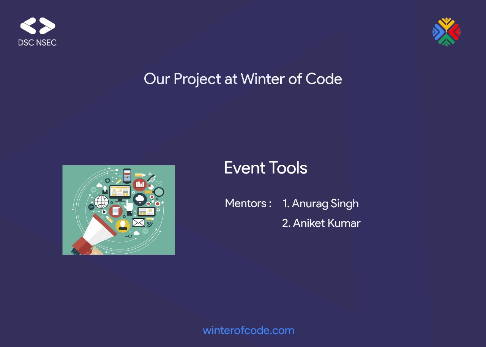

# event-tools
Helper tools for events which make the life of organizers, speakers and attendees easier! 

We currently have the following tools in mind - feel free to include your own ideas in your proposals for the Winter of Code 2019. 

- 1. Logo Generator
- 2. PPT broadcasting app
- 3. Mailer
- 4. Attendee Evaluation System

You may not be willing to work on all the above ideas, just apply for the idea that appeals you! If you have anything else in mind, go ahead and apply for that! Talk to the mentors about the feasibility of your ideas in the [Slack Workspace](http://tiny.cc/dscnsec-slack)

### Mentors: 

| Name | Github |
| -- | -- |
| Aniket Kumar | [ani4aniket](https://github.com/ani4aniket) |
| Anurag Singh | [anuragsingh228](https://github.com/anuragsingh228) |

